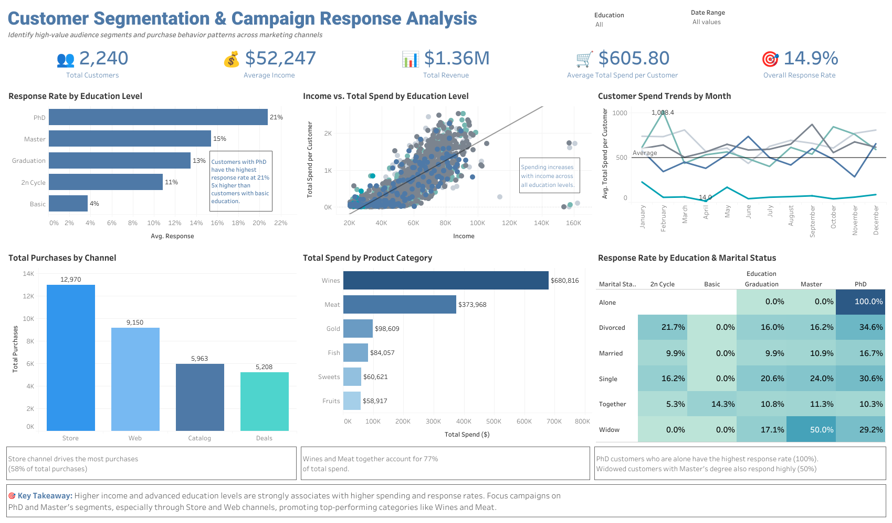

# Customer Segmentation: Campaign Response Analysis

## Project Overview
Interactive Tableau dashboard analyzing customer segmentation, campaign response behavior, and engagement trends. This project focuses on identifying high-value customer groups, evaluating campaign effectiveness, and supporting data-driven marketing and customer engagement strategies through interactive business intelligence reporting.

## Tools Used
- Tableau
- SQL
- Excel

## Key Insights
- Identified high-performing customer segments
- Analyzed customer response and engagement trends
- Evaluated campaign effectiveness across segments
- Compared conversion behavior among customer groups
- Highlighted opportunities for targeted marketing strategies

## Dashboard Features
- Interactive dashboard filters
- Customer segmentation analysis
- Campaign response tracking
- Engagement and conversion visualizations
- KPI scorecards
- Marketing performance reporting views

## Dashboard Preview

## Live Dashboard
[View on Tableau Public][(https://public.tableau.com/app/profile/jeremy.dade/viz/CustomerSegmentationCampaignResponseAnalysis/CustomerSegmentationCampaignResponseAnalysis2)]
